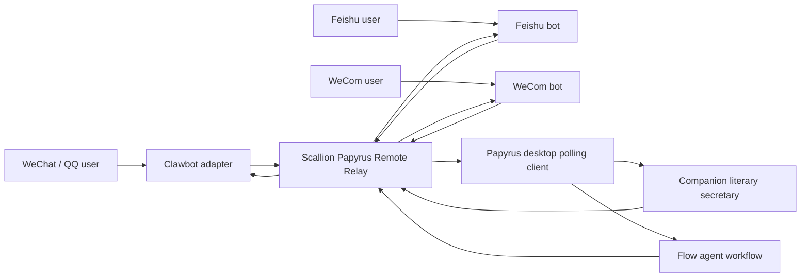

# Papyrus Remote Relay

Papyrus Remote Relay lets a desktop Papyrus instance receive writing tasks from external chat bots without building a separate mobile app. The desktop app stays the executor, while Scallion Relay is the safe message bridge.

## Architecture



Papyrus does not automate private WeChat or QQ protocols. WeChat and QQ access should go through a user-owned Clawbot or similar adapter. Feishu and WeCom should use their official bot webhook systems.

## Desktop Setup

1. Log in to Scallion inside Papyrus settings.
2. Open Settings, then Remote Relay.
3. Enable Relay.
4. Click "Create or refresh channel".
5. Copy the generated webhook URL.
6. Choose the default target:
   - Literary secretary: best for Q&A, explanations, small edits, homework guidance, and research requests.
   - Flow workflow: best for long writing jobs, chapter drafting, argument outlines, research bundles, and multi-agent review.

## Bot Adapter Contract

External bot adapters should send incoming chat messages to the Scallion Relay webhook. The recommended payload is:

```json
{
  "platform": "feishu",
  "senderId": "user-open-id",
  "senderName": "Student A",
  "content": "帮我检查这篇议论文的论证链。",
  "mode": "companion",
  "threadId": "optional-chat-thread",
  "attachments": [
    {
      "name": "draft.txt",
      "text": "optional extracted text"
    }
  ]
}
```

`mode` is optional. When omitted, Papyrus uses the default mode selected in settings.

## Relay API Expected By Papyrus

Papyrus currently expects these Scallion endpoints:

- `POST /api/papyrus/remote/channels`
- `GET /api/papyrus/remote/channels/:channelId/jobs`
- `POST /api/papyrus/remote/jobs/:jobId/ack`
- `POST /api/papyrus/remote/jobs/:jobId/result`
- Optional external adapter entry: `POST /api/papyrus/remote/webhook/:channelId`

Requests from Papyrus include:

- `Authorization: Bearer <Scallion token>`
- `X-Papyrus-Relay-Key: <relay key>` when a relay key exists

## Security Rules

- Do not put bot platform secrets into the Papyrus repo.
- Do not commit relay keys, Scallion tokens, Feishu secrets, WeCom secrets, Clawbot tokens, or QQ/WeChat credentials.
- The Scallion server should verify channel ownership before returning jobs.
- The server should rate-limit webhook calls per channel and platform.
- The desktop client should only poll when the user enables Relay.

## Use Cases

- Send a WeChat or QQ message to Clawbot: "让 Papyrus 帮我把这段记叙文升格。"
- Ask Feishu group bot to summarize reference material and draft an outline.
- Send an enterprise WeCom message to collect writing requirements from a phone.
- Use Papyrus as a literary secretary while commuting, then continue full editing on desktop.
